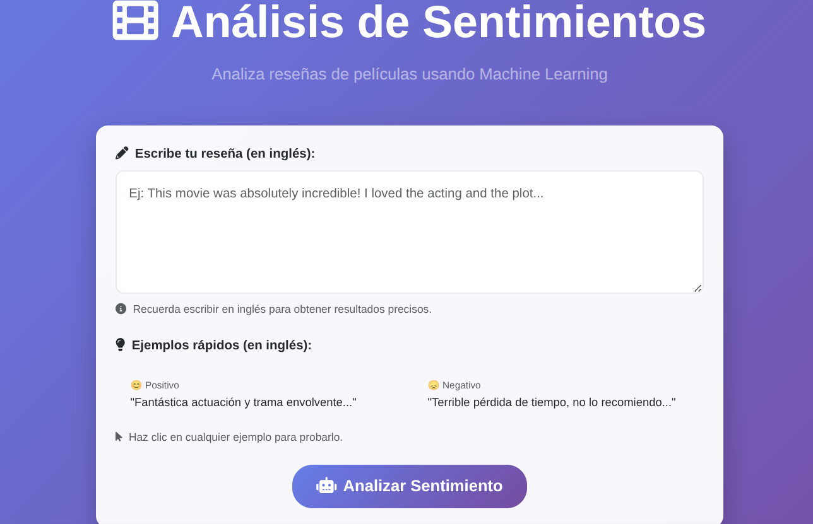
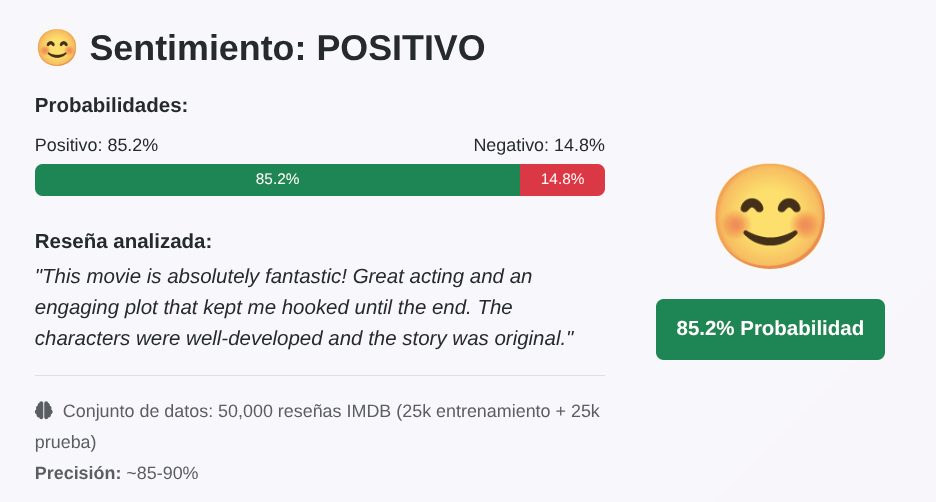

# 🧠 Análisis de sentimientos en reseñas de IMDb

Este proyecto implementa un **pipeline completo de Procesamiento de Lenguaje Natural (PLN)** y **Machine Learning** para analizar reseñas de películas extraídas de IMDb.  
El objetivo es **clasificar automáticamente las reseñas como positivas o negativas** a partir del texto, empleando técnicas estadísticas y de aprendizaje supervisado.

---

## ⚙️ Instalación y requisitos

### 🔹 Requisitos previos
- Python **3.9 o superior**
- pip actualizado (`python -m pip install --upgrade pip`)
- Entorno virtual recomendado (`venv` o `conda`)

### 🔹 Clonar el repositorio

```bash
git clone https://github.com/<TU_USUARIO>/imdb-sentiment-analysis.git
cd imdb-sentiment-analysis
```

### 🔹 Instalar dependencias

```bash
pip install -r requirements.txt
```

### 🔹 Descargar modelo de spaCy

```bash
python -m spacy download en_core_web_sm
```

---

## 🚀 Ejecución y uso

### 🔸 1. Preprocesamiento y modelado

Ejecuta el pipeline principal (entrenamiento y evaluación del modelo):

```bash
python src/modeling_04.py
```

Los resultados (métricas, curvas ROC, matriz de confusión y CSVs de salida) se guardarán automáticamente en la carpeta `output/`.

### 🔸 2. Visualización de resultados

Para generar las visualizaciones y tablas de apoyo:

```bash
python src/visualization_06.py
```

Esto creará:
- `prediction_distribution.png`  
- `probability_histogram.png`  
- `wordcloud_positive.png`  
- `wordcloud_negative.png`  
- `word_freq_for_tableau.csv`

en la carpeta `output/`.

### 🔸 3. Webapp local

El proyecto incluye una **webapp simple** para probar el modelo de manera interactiva.

Desde la raíz del proyecto:

```bash
python deployment/app.py
```

Luego abre tu navegador en:

```
http://127.0.0.1:8000
```

Desde allí podrás introducir reseñas y obtener la predicción en tiempo real.

<p align="center">
  
  
</p>

---

## 📊 Resultados y Dashboard

Los resultados del modelo incluyen:
- **Matriz de confusión normalizada**
- **Curva ROC y AUC**
- **Distribución de predicciones**
- **Nubes de palabras** de reseñas positivas y negativas

Además, se ha creado un **dashboard interactivo** en Tableau Public para la exploración visual de los resultados.

👉 [Ver Dashboard en Tableau Public](https://public.tableau.com/views/AnlisisdeReseasenIMDB/Dashboard1?:language=es-ES&:sid=&:redirect=auth&:display_count=n&:origin=viz_share_link)

---

## 🧩 Estructura del proyecto

```
.
├── data/                  # Datos originales y preprocesados
├── deployment/            # Webapp (app.py)
├── models/                # Modelos y pipelines entrenados
├── output/                # Resultados, métricas y visualizaciones
├── src/                   # Scripts principales del pipeline
│   ├── preprocessing_02.py
│   ├── modeling_04.py
│   └── visualization_06.py
├── tests/                 # Pruebas unitarias
├── requirements.txt
├── LICENSE
└── README.md
```

---

## 🧠 Tecnologías utilizadas

- **Python 3.9+**
- **spaCy** – Tokenización y lematización  
- **scikit-learn** – Modelado y evaluación  
- **pandas**, **numpy** – Manipulación de datos  
- **seaborn**, **matplotlib**, **wordcloud** – Visualización  
- **Flask** – Webapp interactiva  
- **Tableau Public** – Visualización de resultados  

---

## 📚 Licencia y dataset

Este proyecto utiliza el dataset **IMDb Large Movie Review Dataset** introducido por **Maas et al. (2011)**.  
Por favor, cite el trabajo original si reutiliza el dataset o los resultados asociados.

> **Referencia obligatoria:**
>
> Maas, Andrew L., Daly, Raymond E., Pham, Peter T., Huang, Dan, Ng, Andrew Y., and Potts, Christopher.  
> *Learning Word Vectors for Sentiment Analysis.*  
> Proceedings of the 49th Annual Meeting of the Association for Computational Linguistics: Human Language Technologies (ACL-HLT 2011), Portland, Oregon, USA.  
> pp. 142–150.  
> [http://www.aclweb.org/anthology/P11-1015](http://www.aclweb.org/anthology/P11-1015)

Este dataset se distribuye únicamente con fines **educativos y de investigación**.
